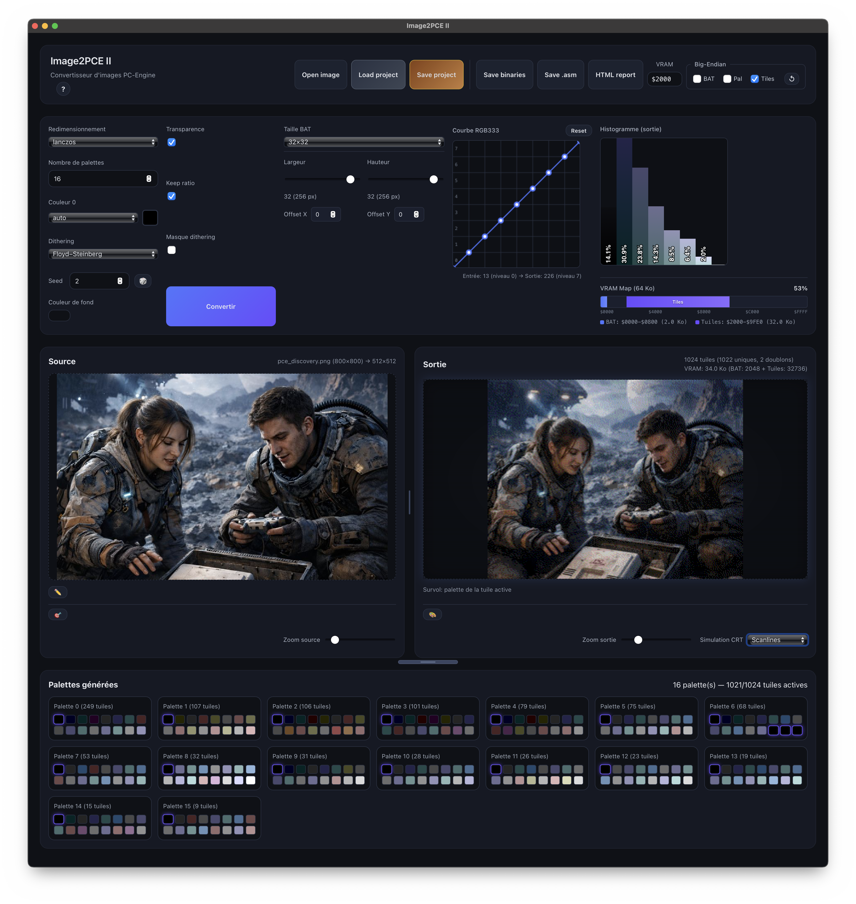

# Guide Utilisateur — Image2PCE II



## Introduction

Image2PCE II est un outil de conversion d'images pour la console PC-Engine / TurboGrafx-16. Il transforme n'importe quelle image en données graphiques compatibles avec les contraintes matérielles de la console :

- Résolution : **Variable** (32 à 128 tuiles en largeur, 32 à 64 tuiles en hauteur)
- Couleurs : **RGB333** (512 couleurs possibles)
- Palettes : **16 palettes** de 16 couleurs chacune
- Tuiles : **8×8 pixels** avec déduplication automatique
- Calcul VRAM : **Affichage en temps réel** de l'occupation mémoire (BAT + tuiles)

---

## Table des matières

1. [Interface](#interface)
   - [Barre supérieure](#barre-supérieure)
   - [Panneau des réglages](#panneau-des-réglages)
2. [Courbe RGB333](#courbe-rgb333)
3. [Visualiseurs](#visualiseurs)
   - [Source (gauche)](#source-gauche)
   - [Sortie (droite)](#sortie-droite)
4. [Masque de dithering](#masque-de-dithering)
5. [Palettes générées](#palettes-générées)
6. [Workflow recommandé](#workflow-recommandé)
7. [Formats d'export](#formats-dexport)
   - [Binaires](#binaires-répertoire-avec-bat-tiles-pal)
   - [Assembleur](#assembleur-asm)
8. [Format technique PC-Engine](#format-technique-pc-engine)
9. [Raccourcis et astuces](#raccourcis-et-astuces)
10. [Dépannage](#dépannage)

---

## Interface

### Barre supérieure

| Bouton | Description |
|--------|-------------|
| **Open image** | Ouvrir une image source (PNG, JPEG, GIF, WebP, BMP) |
| **Save as image** | Sauvegarder l'aperçu converti en PNG |
| **Save binaries** | Crée un répertoire et exporte `.bat`, `.tiles`, `.pal` |
| **Save .asm** | Exporter en format assembleur commenté |
| **VRAM** | Adresse de base VRAM pour les tuiles (défaut: `$4000`) |

### Panneau des réglages

#### Redimensionnement
Choisissez l'algorithme de mise à l'échelle :
- **lanczos** : Haute qualité, recommandé pour les photos
- **nearest** : Pixels nets, idéal pour le pixel art
- **catmullrom** : Bon compromis qualité/netteté

#### Nombre de palettes
Définit le nombre de palettes générées (1 à 16). Plus il y a de palettes, plus les couleurs seront fidèles, mais chaque tuile ne peut utiliser qu'une seule palette.

#### Couleur 0
- **auto** : La couleur de fond est détectée automatiquement
- **fixée** : Cliquez sur une couleur dans les palettes générées pour la définir comme couleur 0 (transparence)

#### Dithering
- **aucun** : Pas de tramage
- **Floyd–Steinberg** : Diffusion d'erreur pour un rendu progressif
- **ordered** : Motif régulier de points

#### Options
- **Transparence** : Active la gestion de la transparence
- **Keep ratio** : Préserve le ratio d'aspect de l'image source
- **Masque dithering** : Active le masque éditable sur l'image source

#### Couleur de fond
Couleur utilisée pour remplir les zones vides (si le ratio est préservé).

#### Taille de sortie
Deux curseurs permettent de définir la taille de l'image convertie :
- **Largeur** : 32 à 128 tuiles (256 à 1024 pixels)
- **Hauteur** : 32 à 64 tuiles (256 à 512 pixels)

La valeur affichée indique le nombre de tuiles et l'équivalent en pixels (ex: `32 (256 px)`).

---

## Courbe RGB333

L'éditeur de courbe permet d'ajuster la quantification des couleurs vers RGB333 (3 bits par canal = 8 niveaux).

- **Axe horizontal** : Valeur d'entrée (0-255)
- **Axe vertical** : Valeur de sortie (0-255, puis quantifiée en 8 niveaux)
- **Points de contrôle** : Glissez pour modifier la courbe
- **Reset** : Réinitialise la courbe linéaire

**Astuce** : Une courbe en S augmente le contraste. Relever les ombres ou abaisser les hautes lumières peut améliorer certaines images.

---

## Visualiseurs

### Source (gauche)
Affiche l'image originale chargée.
- **Zoom** : Utilisez le curseur ou la **molette de la souris** pour agrandir (1x à 8x)
- **Navigation** : Cliquez et glissez pour déplacer l'image

### Sortie (droite)
Affiche le résultat de la conversion en temps réel.
- **Survol** : Passez la souris sur une tuile pour voir sa palette associée
- **Zoom tuile** : Un aperçu 10x de la tuile survolée s'affiche
- **Calcul VRAM** : L'occupation mémoire est affichée (BAT + tuiles uniques)
  - Si la taille dépasse **64 Ko**, un avertissement en rouge s'affiche
  - La déduplication des tuiles permet d'économiser de la VRAM

#### Simulation CRT
Simulez l'affichage sur un écran cathodique :

| Mode | Description |
|------|-------------|
| **Aucune** | Pas de simulation |
| **Scanlines** | Lignes de balayage horizontales |
| **Aperture Grille** | Bandes RGB verticales (style Trinitron) |
| **Shadow Mask** | Motif de points RGB (TV classique) |
| **Composite** | Combinaison complète avec vignettage |

Un léger flou analogique est automatiquement appliqué lorsqu'un mode CRT est sélectionné.

---

## Masque de dithering

Le masque de dithering permet de contrôler précisément où le tramage est appliqué sur l'image. Activez-le avec la checkbox **Masque dithering** dans les réglages.

### Activer l'édition
Cliquez sur le bouton **crayon** (✏️) sous l'image source pour activer le mode édition. Le masque apparaît en semi-transparence sur l'image.

### Outils disponibles

| Outil | Description |
|-------|-------------|
| **Pinceau** (🖌️) | Peint en noir = zones **avec** dithering |
| **Gomme** (🧽) | Peint en blanc = zones **sans** dithering |
| **Cercle** (⭕) | Trace un cercle plein (clic = centre, glisser = rayon) |
| **Rectangle** (⬜) | Trace un rectangle plein (clic = coin, glisser = coin opposé) |
| **Polygone** (🔷) | Trace un polygone (clic = ajouter point, fermer ou double-clic = terminer) |
| **Annuler** (↩️) | Annule la dernière action |
| **Rétablir** (↪️) | Rétablit l'action annulée |
| **Taille** | Ajuste le diamètre du pinceau (5-100 pixels) |
| **Effacer** | Remplit tout le masque en blanc (aucun dithering) |
| **Remplir** | Remplit tout le masque en noir (dithering partout) |
| **Inverser** | Inverse le masque (noir ↔ blanc) |

### Outils de forme (cercle, rectangle, polygone)
- Par défaut, les formes remplissent en **noir** (dithering)
- **Double-clic** sur le bouton : bascule en mode **blanc** (pas de dithering)
- Un indicateur visuel (fond bicolore) montre le mode actif
- **Shift** pendant le tracé : inverse temporairement la couleur

### Raccourcis clavier

| Touche | Action |
|--------|--------|
| **X** | Basculer entre pinceau et gomme |
| **Ctrl+Z** | Annuler |
| **Ctrl+Y** | Rétablir |
| **Escape** | Annuler le polygone en cours |
| **Clic droit** | Annuler le polygone en cours |
| **Shift + glisser** | Déplacer l'image pendant l'édition |
| **Molette** | Zoomer/dézoomer |

### Fonctionnement
- **Noir** = le dithering sera appliqué dans cette zone
- **Blanc** = pas de dithering, couleurs unies

Le masque est automatiquement redimensionné pour correspondre à l'image de sortie, y compris si l'option "Keep ratio" est activée.

---

## Palettes générées

Après conversion, les 16 palettes sont affichées avec leur utilisation :
- Le nombre de tuiles utilisant chaque palette est indiqué
- Cliquez sur une couleur pour la définir comme couleur 0
- La palette survolée sur l'image de sortie est mise en évidence

---

## Workflow recommandé

1. **Ouvrir** une image avec "Open image"
2. **Ajuster** les paramètres selon le type d'image :
   - Photo : lanczos + Floyd-Steinberg + 16 palettes
   - Pixel art : nearest + aucun dithering + palettes réduites
3. **Modifier** la courbe RGB333 si nécessaire
4. **Convertir** en cliquant sur le bouton bleu
5. **Vérifier** le résultat avec la simulation CRT
6. **Exporter** dans le format souhaité

---

## Formats d'export

### Binaires (répertoire avec `.bat`, `.tiles`, `.pal`)

L'export binaire crée un **répertoire** portant le nom choisi, contenant 3 fichiers :

| Fichier | Contenu | Taille |
|---------|---------|--------|
| `.bat` | Block Address Table (mots 16 bits, little-endian) | Variable (2 × nb tuiles) |
| `.tiles` | Données des tuiles (format planaire PCE) | Variable (32 × nb tuiles uniques) |
| `.pal` | 16 palettes × 16 couleurs × 2 octets | 512 octets |

**Important** : Le fichier `.tiles` commence toujours par une **tuile vide** (32 octets à zéro) en position 0. Les tuiles vides de l'image pointent toutes vers cette première tuile, ce qui permet d'économiser de la VRAM.

### Assembleur (`.asm`)

Fichier texte avec :
- Données BAT formatées en `.dw`
- Données des tuiles en `.db`
- Données des palettes avec commentaires
- Statistiques (tuiles uniques, doublons, taille mémoire)

---

## Format technique PC-Engine

### BAT (Block Address Table)
```
Bit 15-12 : Index de palette (0-15)
Bit 11-0  : Adresse VRAM >> 4
```

### Tuile planaire (32 octets)
```
Octets 0-7   : Plan 0, lignes 0-7
Octets 8-15  : Plan 1, lignes 0-7
Octets 16-23 : Plan 2, lignes 0-7
Octets 24-31 : Plan 3, lignes 0-7
```

### Couleur PCE (9 bits dans mot 16 bits)
```
0000 0GGG RRRB BB00
      │    │   └── Bleu (3 bits)
      │    └────── Rouge (3 bits)
      └─────────── Vert (3 bits)
```

---

## Raccourcis et astuces

### Navigation
- **Molette souris** : Zoomer/dézoomer sur les visualiseurs
- **Glisser** : Déplacer l'image dans un visualiseur
- **Shift + glisser** : Déplacer l'image pendant l'édition du masque

### Général
- Les réglages sont sauvegardés automatiquement
- Double-cliquez sur le preview couleur 0 pour ouvrir le sélecteur de couleur
- L'adresse VRAM accepte les formats `$4000` ou `0x4000`
- Les tuiles vides (entièrement couleur 0) sont automatiquement dédupliquées

---

## Dépannage

**L'image est trop sombre/claire après conversion**
→ Ajustez la courbe RGB333 pour compenser

**Les couleurs sont trop différentes de l'original**
→ Augmentez le nombre de palettes ou essayez un autre mode de dithering

**L'export binaire ne fonctionne pas**
→ Vérifiez que vous avez bien converti l'image avant d'exporter

**La simulation CRT n'apparaît pas**
→ Sélectionnez un mode autre que "Aucune" dans le menu déroulant
